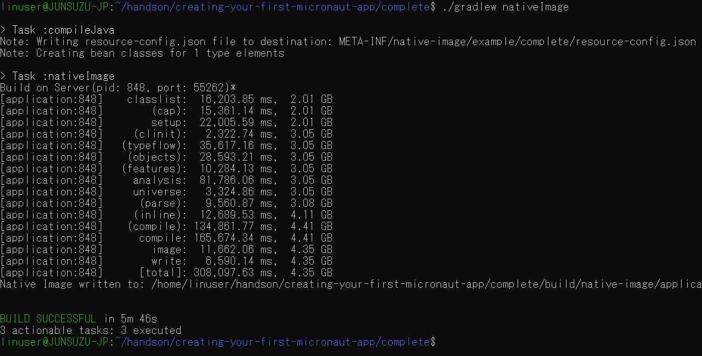
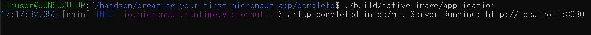

# Oracle GraalVM Enterprise ハンズオン演習 (Advance編)

## ＜目的と対象＞：
このハンズオン演習は、下記Oracle GraalVM Enterpriseハンズオン演習のアドバンス編になります。  
[Oracle GraalVM Enterprise ハンズオン演習 (Basic編)](https://github.com/junsuzu/graalvm-jp-handson-basic/)

Basic編では、次世代Polyglot(多言語プログラミング）対応実行環境であるOracle GraalVM Enterprise版の導入と操作手順を学びましたが、この演習ではGraalVMをCloud Native環境で応用するためのより高度な内容となります。演習を通して以下の項目をマスターすることを目的としています。  
* GraalVMのNative Image機能でMicroservicesを作る
* GraalVMのPGOチューニング
* GraalVM  

このハンズオン演習の対象は上記Basic編を習得済みであることは望ましいが、必須ではありません。  

※この内容はOracle主催のOracle GraalVM Enterprise Virtual Hands-On Lab(Advance)の演習部分にあたります。  
参加者はこちらの内容に沿って事前環境セットアップおよび当日演習を実施して頂けます。また単独でGraalVMのアドバンス編演習としてもご利用頂けます。  
<br/>

## ＜前提環境／事前準備＞
* ハンズオンの内容はWindows10でWSL(Windows Subsystem for Linux)を利用し、LinuxディストリビューションのUbuntu20.04をインストールした環境を前提に進みます。  
* Ubuntu以外のLinuxおよびMacOS、Windowsもサポートされます。
* Githubリポジトリーからダウンロードすることがあるので、インターネットに繋がる状態が必要です。  

※「Oracle GraalVM Enterprise Virtual Hands-On Lab」の参加者は基本的に事前セットアップ済みの環境でハンズオン演習を実施して頂きます。ただし、演習が不要な方は、演習部分を視聴のみして頂くことも可能です。  
<br/>


## ＜演習内容＞

* **[演習 1: GraalVMとMicronautによるマイクロサービス作成](#演習-1-GraalVMとMicronautによるマイクロサービス作成)**
   * [1.1: GraalVM EE20.1.0のダウンロード](#11-GraalVM-EE2010のダウンロード)
   * [1.2: GraalVM Coreパッケージのインストール](#12-GraalVM-Coreパッケージのインストール)
   * [1.3: Native Imageのインストール](#13-Native-Imageのインストール)
   * [1.4: LLVMとR言語プラグインのインストール](#14-LLVMとR言語プラグインのインストール)

* **[演習 2: GraalVMとSpringBootによるマイクロサービス作成](#演習-1-GraalVMとSpringBootによるマイクロサービス作成)**
* **[演習 3: Native Imageの生成と実行](#演習-3-Native-Imageの生成と実行)**
* **[演習 4: Polyglotプログラミングと実行](#演習-4-Polyglotプログラミングと実行)**
<br/>
<br/>


# 演習-1-GraalVMとMicronautによるマイクロサービス作成

この演習では、以下の内容を実施します。  
* Micronautアプリケーションの導入と稼働確認
* GraalVMでMicronautアプリのnative imageの作成と稼働確認
* native imageをベースにDockerイメージを作成し、Dockerコンテナによるマイクロサービスの稼働を確認

# 1.1: Micronautアプリケーションの導入

(1)下記GitリポジトリーよりMicronautのサンプルアプリケーションをダウンロードします。

  >```sh
  >$ git clone https://github.com/micronaut-guides/creating-your-first-micronaut-app.git
  >```
<br/>

(2)作成済みのソースコードを含む下記ディレクトリへ移動します。

  >```sh
  >$ cd micronaut-creating-first-graal-app/complete
  >```
<br/>

(3)導入したMicronautアプリケーションにはMicronautのメインアプリケーションおよびマイクロサービスの内容をそれぞれ確認します。HelloControllerはHTTPリクエストに対して、"Hello World"という文字列をリターンします。
  
src/main/java/example/micronaut/Application.java
```java
package example.micronaut;

import io.micronaut.runtime.Micronaut;

public class Application {

    public static void main(String[] args) {
        Micronaut.run(Application.class);
    }
}
```  
src/main/java/example/micronaut/HelloController.java
```java
package example.micronaut;

import io.micronaut.http.MediaType;
import io.micronaut.http.annotation.Controller;
import io.micronaut.http.annotation.Get;
import io.micronaut.http.annotation.Produces;

@Controller("/hello")  //①
public class HelloController {
    @Get //②
    @Produces(MediaType.TEXT_PLAIN)  //③
    public String index() {
        return "Hello World"; //④
    }
}
```
* ① @Controller アノテーションがコントローラーを定義し、/helloというリクエスト・パスに対応します。  
* ② @Get アノテーションは下記index メソッドをすべてのHTTP Getリクエストに対応するようにマッピングします。
* ③ デフォルトではMicronautアプリのリスポンスのContentTypeはapplicaiton/jasonです。ここではJSONオブジェクトの代わりにStringをリターンしますので、text/plain を明示的に指定します。
* ④　"Hello World"　をリターンします。

(4)このMicronautアプリケーションを起動します。

  >```sh
  >$ gradlew run
  >```
<br/>
Micronautによるマイクロサービスが起動していることを確認します。

```
Starting a Gradle Daemon (subsequent builds will be faster)

> Task :compileJava
Note: Creating bean classes for 1 type elements

> Task :run
12:55:57.718 [main] INFO  io.micronaut.runtime.Micronaut - Startup completed in 2583ms. Server Running: http://localhost:8080
<=========----> 75% EXECUTING [3m 55s]                                                      > :run
```

別ターミナルを立ち上げ、マイクロサービスにアクセスしてみましょう。"Hello World"がレスポンスとして表示されることを確認します。

```
$ curl http://localhost:8080/hello
Hello World
```
マイクロサービスをCtrl+Cで停止します。  
<br/>

# 1.2: GraalVMを使用してNative Imageを作成

(1) Basic編演習で導入したGraalVMのバージョンを再確認します。(GraalVMのバージョンは20.1.0以上であれば問題ありません。)

  >```sh
  >$ java -version  
  >```

  >```sh
  >java version "1.8.0_251"
  >Java(TM) SE Runtime Environment (build 1.8.0_251-b08)
  >Java HotSpot(TM) 64-Bit Server VM GraalVM EE 20.1.0 (build 25.251-b08-jvmci-20.1-b02, mixed mode)  
  >
<br/>

(2)GraalVMを使用し、MicronautサンプルアプリケーションのNative Imageを作成します。  


  >```sh
  >$ ./gradlew nativeImage  
  >```
<br/>
mavenでビルドする場合、下記コマンドを使用します。

  >```sh
  >$ ./mvn package -Dpackaging=native-image  
  >```
<br/>

環境によってNative Imageビルドに少し時間がかかります。下図のようにビルド成功のメッセージを確認します。  



gradleを利用しビルドした結果、build/native-image/配下にapplicationという名前のNative Imageが作成されていることが確認できます。  
mavenを利用した場合、./target配下となります。  

(3)作成したMicronautアプリケーションのNative Imageを動かしてみましょう。  
* gradleの場合
  >```sh
  >$ ./build/native-image/application  
  >```
* mavenの場合
  >```sh
  >$ ./target/application  
  >```

アプリケーション起動した結果、8080番ポートでMicronautアプリケーションのサービスが短い時間で起動していることが確認できます。
```
$ ./build/native-image/application
13:22:50.338 [main] INFO  io.micronaut.runtime.Micronaut - Startup completed in 571ms. Server Running: http://localhost:8080
```

別ターミナルを立ち上げ、起動中のサービスに対してリクエストを送ってみます。レスポンスのHello Worldが表示されることを確認します。
  >```sh
  >$ curl localhost:8080/hello  
  >Hello World
  >```
<br/>

マイクロサービスをCtrl+Cで停止します。  
<br/>

# 1.3: GraalVMとDockerでNative Imageを作成

(1)Dockerデーモンを起動します。本演習の環境ではWindowsのDocker DesktopをDockerデーモンとして2375番ポートでオープンします。Ubuntu側のDockerクライアントはそのデーモンに接続します。下記はDocker Desktopのsetting画面です。



(2)以下のコマンドを実行し、Docker内でnative imageを作成します。

  >```sh
  >$ ./gradlew dockerBuild
  >```
<br/>
以下のようにDockerのビルドが正常に終了していることを確認します。

```
$ ./gradlew dockerBuild

> Task :dockerfile
Dockerfile written to: /home/linuser/handson/creating-your-first-micronaut-app/complete/build/docker/Dockerfile

> Task :dockerBuild
Building image using context '/home/linuser/handson/creating-your-first-micronaut-app/complete'.
Using Dockerfile '/home/linuser/handson/creating-your-first-micronaut-app/complete/build/docker/Dockerfile'
Using images 'complete'.
Step 1/7 : FROM openjdk:15-alpine
 ---> f02adfce91a2
Step 2/7 : WORKDIR /home/app
 ---> Using cache
 ---> 052c899af729
Step 3/7 : COPY build/layers/libs /home/app/libs
 ---> Using cache
 ---> 0014ade92408
Step 4/7 : COPY build/layers/resources /home/app/resources
 ---> Using cache
 ---> ee23a89788fd
Step 5/7 : COPY build/layers/application.jar /home/app/application.jar
 ---> 70b4e26ea04b
Step 6/7 : EXPOSE 8080
 ---> Running in fc0eecaa78ef
Removing intermediate container fc0eecaa78ef
 ---> abd8ce32429d
Step 7/7 : ENTRYPOINT ["java", "-jar", "/home/app/application.jar"]
 ---> Running in de8723a37b41
Removing intermediate container de8723a37b41
 ---> e5ca0570af3e
Successfully built e5ca0570af3e
Successfully tagged complete:latest
Created image with ID 'e5ca0570af3e'.

BUILD SUCCESSFUL in 16s
6 actionable tasks: 2 executed, 4 up-to-date
linuser@JUNSUZU-JP:~/handson/creating-your-first-micronaut-app/complete$

```

(3)Dockerコンテナを起動します。
```
$ docker run -p 8080:8080 complete
04:17:28.943 [main] INFO  io.micronaut.runtime.Micronaut - Startup completed in 1441ms. Server Running: http://e1a0e02a8b2d:8080

```
別ターミナルを立ち上げ、起動中のDockerサービスに対してリクエストを送ってみます。レスポンスのHello Worldが表示されることを確認します。
  >```sh
  >$ curl localhost:8080/hello  
  >Hello World
  >```
<br/>

Docker コンテナとDocker Imageを確認できます。
```
$ docker ps -l
CONTAINER ID   IMAGE      COMMAND                  CREATED         STATUS         PORTS                    NAMES
e1a0e02a8b2d   complete   "java -jar /home/app…"   3 minutes ago   Up 3 minutes   0.0.0.0:8080->8080/tcp   unruffled_golick
```
```
$ docker images
REPOSITORY    TAG         IMAGE ID       CREATED          SIZE
complete      latest      e5ca0570af3e   17 minutes ago   357MB
```

# 演習 2: High-performance JIT コンパイラ
以下の演習は「Top 10 Things To Do With GraalVM」 の内容を使用します。  
https://medium.com/graalvm/graalvm-ten-things-12d9111f307d

(1)上記内容を使用するため、Githubよりソースをダウンロードします。任意の作業ディレクトリーで以下のコマンドを実行します。

  >```sh
  >git clone https://github.com/chrisseaton/graalvm-ten-things/
  >```

(2)上記コマンドの結果、"graalvm-ten-things"というディレクトリーが作成されます。そのディレクトリーに移動します。

  >```sh
  >cd graalvm-ten-things
  >```

(3)以下のコマンドを実行し、サイズが約150MBに及ぶテキストファイル"large.txt"を作成します。この作業は少し時間がかかります。

  >```sh
  >make large.txt
  >```

(4)large.txtファイルが作成されたことをlsコマンドで確認します。サイズが150MBであることが確認できます。


(5)この演習で使用するサンプルプログラムTopTen.javaはlarge.txtの中から単語を集計し、上位トップテンの単語一覧を出力するJavaプログラムです。このプログラムはStream Java APIを使用し、すべての単語をソートし、カウントします。 

以下はプログラムの内容です。
```java
import java.io.IOException;
import java.nio.file.Files;
import java.nio.file.Paths;
import java.util.Arrays;
import java.util.function.Function;
import java.util.stream.Collectors;
import java.util.stream.Stream;

public class TopTen {

    public static void main(String[] args) {
        Arrays.stream(args)
                .flatMap(TopTen::fileLines)
                .flatMap(line -> Arrays.stream(line.split("\\b")))
                .map(word -> word.replaceAll("[^a-zA-Z]", ""))
                .filter(word -> word.length() > 0)
                .map(word -> word.toLowerCase())
                .collect(Collectors.groupingBy(Function.identity(), Collectors.counting()))
                .entrySet().stream()
                .sorted((a, b) -> -a.getValue().compareTo(b.getValue()))
                .limit(10)
                .forEach(e -> System.out.format("%s = %d%n", e.getKey(), e.getValue()));
    }

    private static Stream<String> fileLines(String path) {
        try {
            return Files.lines(Paths.get(path));
        } catch (IOException e) {
            throw new RuntimeException(e);
        }
    }

}
```

(6)TopTen.javaをコンパイルします。デフォルトではクラスパスが通るGraalVMのJITコンパイラが有効になります。

  >```sh
  >javac TopTen.java
  >```

(7)GraalVMのJITコンパイラはJavaで書かれています。以下の最適化によりJITコンパイラの実行速度が従来C++で書かれていたコンパイラよりも速くなります。  
* Partial Escape Analysis  
* In-lining  
* Path Duplication

以下のJavaコマンドでコンパイルされたJavaクラスを実行し、実行タイムを測ります。引数にはlarge.txtを指定します。

  >```sh
  >time java TopTen large.txt
  >```

実行結果と実行時間を確認します。

```
sed = 502500
ut = 392500
in = 377500
et = 352500
id = 317500
eu = 317500
eget = 302500
vel = 300000
a = 287500
sit = 282500

real    0m32.699s
user    0m34.078s
sys     0m3.406s  
```  
(8)従来のJITコンパイラと比較するため、以下のJavaコマンドでフラッグを立てます：-XX:-UseJVMCICompile。JVMCIはGraalVMとJVMのあいだのインタフェースです。このフラッグによりJVMCIが使用されず、従来のJITコンパイラが使用されます。

  >```sh
  >time java -XX:-UseJVMCICompiler TopTen large.txt
  >```

実行結果と実行時間を確認します。

```
sed = 502500
ut = 392500
in = 377500
et = 352500
id = 317500
eu = 317500
eget = 302500
vel = 300000
a = 287500
sit = 282500

real    0m48.901s
user    0m49.219s
sys     0m2.172s

```  
以上の結果から、GraalVMのJITコンパイラの実行時間は従来のコンパイラに比べて約30%短縮したことが分かります。  
<br/>
<br/>


# 演習 3: Native Imageの生成と実行
この演習の中に、GraalVMの中のAhead-of-Time(AOT)機能を利用して軽量で高速起動のNaitve Imageを作成します。  

JITコンパイラはロングラン・アプリやピーク時高いスループットが要求されるアプリに強さを発揮できる一方、スタートアップ時間がかかることと、比較的に多くなメモリーを消費するデメリットがあります。以下の例は、ファイルサイズの小さい（１KB)ファイルに対してTopTenクラスを実行した場合、起動時間と消費メモリーを測定した結果です。　　

(1)graalvm-ten-thingsディレクトリーに移動します。

  >```sh
  >cd graalvm-ten-things
  >```

(2)以下のコマンドを実行し、small.txtファイルを作成します。

  >```sh
  >make small.txt
  >```
(3)small.txtファイルが作成されたことをlsコマンドで確認します。サイズが1KBであることを確認してください。


(4)以下のコマンドを実行し、small.txtの単語を集計するプログラムTopTenを実行します。

  >```sh
  >/usr/bin/time -v java TopTen small.txt
  >```
出力結果を確認し、実行時間とメモリーを確認します。
```
sed = 6
sit = 6
amet = 6
mauris = 3
volutpat = 3
vitae = 3
dolor = 3
libero = 3
tempor = 2
suscipit = 2
        Command being timed: "java TopTen small.txt"
        User time (seconds): 0.71
        System time (seconds): 0.39
        Percent of CPU this job got: 135%
        Elapsed (wall clock) time (h:mm:ss or m:ss): 0:00.82
        Average shared text size (kbytes): 0
        Average unshared data size (kbytes): 0
        Average stack size (kbytes): 0
        Average total size (kbytes): 0
        Maximum resident set size (kbytes): 53976
        Average resident set size (kbytes): 0
        Major (requiring I/O) page faults: 0
        Minor (reclaiming a frame) page faults: 15495
        Voluntary context switches: 0
        Involuntary context switches: 0
        Swaps: 0
        File system inputs: 0
        File system outputs: 0
        Socket messages sent: 0
        Socket messages received: 0
        Signals delivered: 0
        Page size (bytes): 4096
        Exit status: 0
```  

(5)GraalVMが提供しているツールを使用して実行可能なNative Imageを作成します。実行ファイルの作成に少し時間がかかります。

  >```sh
  >native-image --no-server --no-fallback TopTen
  >```
出力結果を確認します。
```
linuser@JUNSUZU-JP:~/handson/graalvm-ten-things$ native-image --no-server --no-fallback TopTen
[topten:166]    classlist:   5,361.17 ms,  1.13 GB
[topten:166]        (cap):  15,043.95 ms,  1.58 GB
[topten:166]        setup:  21,198.24 ms,  1.58 GB
[topten:166]     (clinit):     376.17 ms,  1.76 GB
[topten:166]   (typeflow):   9,617.27 ms,  1.76 GB
[topten:166]    (objects):   7,946.82 ms,  1.76 GB
[topten:166]   (features):     892.17 ms,  1.76 GB
[topten:166]     analysis:  20,176.83 ms,  1.76 GB
[topten:166]     universe:     752.08 ms,  1.76 GB
[topten:166]      (parse):   1,989.35 ms,  1.76 GB
[topten:166]     (inline):   2,549.77 ms,  1.76 GB
[topten:166]    (compile):  32,064.48 ms,  2.89 GB
[topten:166]      compile:  38,520.67 ms,  2.89 GB
[topten:166]        image:   2,367.76 ms,  2.89 GB
[topten:166]        write:   1,849.13 ms,  2.89 GB
[topten:166]      [total]:  90,988.07 ms,  2.89 GB
```  
これにより、軽量な実行ファイル"topten"が作成されたことを確認します。


以下のコマンドでtoptenのサイズを確認できます。

  >```sh
  >du -h topten
  >```

(6)以下のコマンドで、実行ファイルtoptenを実行します。引数にsmall.txtを設定します。

  >```sh
  >/usr/bin/time -v ./topten small.txt
  >```
出力結果を確認し、実行時間とメモリーを確認します。
```
sed = 6
sit = 6
amet = 6
mauris = 3
volutpat = 3
vitae = 3
dolor = 3
libero = 3
tempor = 2
suscipit = 2
        Command being timed: "./topten small.txt"
        User time (seconds): 0.01
        System time (seconds): 0.23
        Percent of CPU this job got: 70%
        Elapsed (wall clock) time (h:mm:ss or m:ss): 0:00.35
        Average shared text size (kbytes): 0
        Average unshared data size (kbytes): 0
        Average stack size (kbytes): 0
        Average total size (kbytes): 0
        Maximum resident set size (kbytes): 4968
        Average resident set size (kbytes): 0
        Major (requiring I/O) page faults: 0
        Minor (reclaiming a frame) page faults: 1324
        Voluntary context switches: 0
        Involuntary context switches: 0
        Swaps: 0
        File system inputs: 0
        File system outputs: 0
        Socket messages sent: 0
        Socket messages received: 0
        Signals delivered: 0
        Page size (bytes): 4096
        Exit status: 0
```  
この結果は上記(4)と比較して、実行時間とメモリーはそれぞれ以下のようになります。
|  |JIT実行  |AOT実行  |
|---|---|---|
|実行時間  |0.71秒  |0.01秒  |
|メモリー  |53976kb  |4968kb  |
  
<br/>
<br/>
  

# 演習 4: Polyglotプログラミングと実行
GraalVM内部ではTruffleというフレームワークを使用してJava以外のプログラミング言語をGraalVMのJITコンパイラ上で動かすことができます。以下の演習では、一本のJavaScriptプログラム（polyglot.js)の中にGraalVMのpolyglot APIを使用し、JavaとRの両方を呼び出します。大きい整数の扱いがより効率的であるJavaのBigIntegerクラスを利用しながら、描画が得意とするRで3Dグラフを作成します。  

(1)まずNode.jsで利用できるWebアプリケーションフレームワークExpressをインストールします。以下のコマンドを実行します。

  >```sh
  >$GRAALVM_HOME/bin/npm install express
  >```


(2)polyglot.jsの中身を確認します。このプログラムの中にJavaとRの両方を呼び出しています。
```js
const express = require('express')
const app = express()

const BigInteger = Java.type('java.math.BigInteger')

app.get('/', function (req, res) {
  var text = 'Hello World from Graal.js!<br> '

  // Using Java standard library classes
  text += BigInteger.valueOf(10).pow(100)
          .add(BigInteger.valueOf(43)).toString() + '<br>'

  // Using R interoperability to create graphs
  text += Polyglot.eval('R',
    `svg();
     require(lattice);
     x <- 1:100
     y <- sin(x/10)
     z <- cos(x^1.3/(runif(1)*5+10))
     print(cloud(x~y*z, main="cloud plot"))
     grDevices:::svg.off()
    `);

  res.send(text)
})

app.listen(3000, function () {
  console.log('Example app listening on port 3000!')
})
```


(3)polyglot.jsを実行します。
>```sh
>$GRAALVM_HOME/bin/node --jvm --polyglot polyglot.js
>```

実行結果を確認するため、http://localhost:3000/ をブラウザでオープンして確認します。


<br/>

お疲れ様でした！
<br/>
ここまでは、Oracle GraalVM Enterprise ハンズオン演習 (Basic編)の内容はすべて終了しました。この演習では以下の項目について学びました。
 
* GraalVMの導入
* GraalVM JITコンパイラでJavaクラスを実行
* GraalVM AOTコンパイラでNative Imageの生成と実行
* Polyglot 多言語プログラミングと実行 

