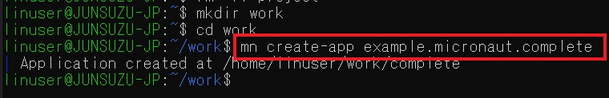
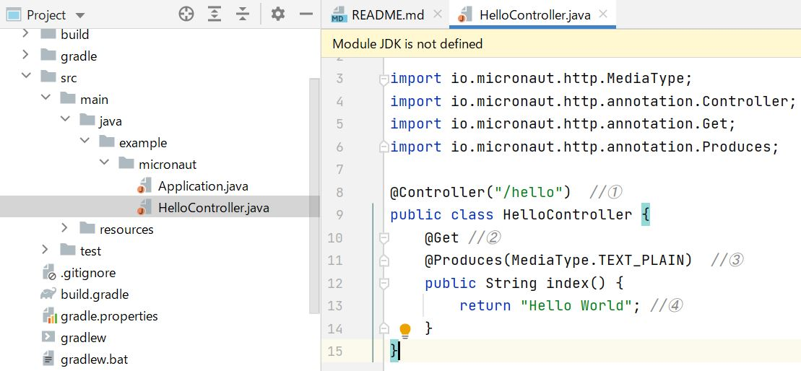

# Oracle GraalVM Enterprise ハンズオン演習 (Advance編)

## ＜目的と対象＞：
このハンズオン演習は、下記Oracle GraalVM Enterpriseハンズオン演習のアドバンス編になります。  
[Oracle GraalVM Enterprise ハンズオン演習 (Basic編)](https://github.com/junsuzu/graalvm-jp-handson-basic/)

Basic編では、次世代Polyglot(多言語プログラミング）対応実行環境であるOracle GraalVM Enterprise版の導入と操作手順を学びましたが、この演習ではGraalVMとフレームワークによるマイクロサービスの作成を実施します。演習を通して以下の項目を体験することを目的としています。  
* GraalVMとMicronautによるアプリケーション開発
* GraalVMとSpringBootによるアプリケーション開発  

このハンズオン演習の対象は上記Basic編を習得済みであることは望ましいが、必須ではありません。  

※この内容はOracle Java GBU主催のOracle GraalVM Enterprise 最新動向&ハンズオン・ワークショップの演習部分にあたります。  
参加者はこちらの内容に沿って事前環境セットアップおよび当日演習を実施して頂けます。また単独でGraalVMのアドバンス編演習としてもご利用頂けます。  
<br/>

## ＜前提環境／事前準備＞
* OS: Windows10 + WSL(Windows Subsystem for Linux) + Ubuntu20.04  
* Docker Engine on Ubuntu 20.10.2([Install Docker Engine on Ubuntu](https://docs.docker.com/engine/install/ubuntu/)) 
* Docker Desktop for Windows 20.10.2([Install Docker Desktop for Windows](https://docs.docker.jp/docker-for-windows/install.html)) 
* Micronaut Linux版 ([SDKmanによるインストール](https://micronaut.io/download.html))
* GraalVM EE 20.3.0 Java8 Linux版 ([ハンズオン演習 Basic編参照](https://github.com/junsuzu/graalvm-jp-handson-basic/)) (※本演習ではCoreパッケージおよびNative Imageコンポーネントのみ必要)
* IntelliJ IDEA Community 2020.3 Windows版(オプション)
* [Docker環境設定](#付録-Docker環境設定)

※ハンズオンの参加者は事前セットアップ済みの環境でハンズオン演習を実施して頂きます。ただし、演習が不要な方は、演習部分を視聴のみして頂くことも可能です。  
<br/>


## ＜演習内容＞

* **[演習 1: GraalVMとMicronautによるマイクロサービス作成](#演習-1-GraalVMとMicronautによるマイクロサービス作成)**
   * [1.1: Micronautアプリケーションの作成と起動](#11-Micronautアプリケーションの作成と起動)
   * [1.2: GraalVMを使用してNative Imageを作成](#12-GraalVMを使用してNative-Imageを作成)
   * [1.3: GraalVMとDockerでNative Imageを作成](#13-GraalVMとDockerでNative-Imageを作成)
   

* **[演習 2: GraalVMとSpringBootによるマイクロサービス作成](#演習-2-GraalVMとSpringBootによるマイクロサービス作成)**
   * [2.1: SpringフレームワークでRESTfulのWebサービスを作成](#21-SpringフレームワークでRESTfulのWebサービスを作成)
   * [2.2: Springアプリケーションからnative imageを生成](#22-Springアプリケーションからnative-imageを生成)
   * [2.3: native imageをベースにDockerコンテナを生成](#23-native-imageをベースにDockerコンテナを生成)
<br/>
<br/>


# 演習-1-GraalVMとMicronautによるマイクロサービス作成

この演習では、以下の内容を実施します。  
* Micronautアプリケーションの導入と稼働確認
* GraalVMでMicronautアプリのnative imageの作成と稼働確認
* native imageをベースにDockerイメージを作成し、Dockerコンテナによるマイクロサービスの稼働を確認
</br>

# 1.1-Micronautアプリケーションの作成と起動

(1) Micronautアプリケーションの作成  

任意のディレクトリーを作成し、その配下にMicronaut CLI(Command Line Interface)を利用してMicronautプロジェクトexample.micronaut.completeを作成します。
  >```sh
  >$ mn create-app example.micronaut.complete
  >```



上記コマンドより、completeフォルダが作成されていることをご確認ください。
<br/>

(2)エディターもしくはIDE環境を使用し、上記(1)で作成したアプリケーションをカスタマイズし、Micronautコントローラーを追加します。  
src>main>java>example.microanutパッケージの配下に新規JavaソースファイルHelloController.javaを作成します。HelloControllerはHTTPリクエストに対して、"Hello World"という文字列をリターンします。下記はIntelliJ IDEAからcompleteフォルダーを開き、Javaファイルを新規追加するイメージです。



既存のApplicationおよび新規作成のHelloControllerのソースはそれぞれ下記をご確認ください。IntelliJ IDEA上ソースを作成したら、Ctrl+Sで保存します。
  
src/main/java/example/micronaut/Application.java
```java
package example.micronaut;

import io.micronaut.runtime.Micronaut;

public class Application {

    public static void main(String[] args) {
        Micronaut.run(Application.class);
    }
}
```  
src/main/java/example/micronaut/HelloController.java
```java
package example.micronaut;

import io.micronaut.http.MediaType;
import io.micronaut.http.annotation.Controller;
import io.micronaut.http.annotation.Get;
import io.micronaut.http.annotation.Produces;

@Controller("/hello")  //①
public class HelloController {
    @Get //②
    @Produces(MediaType.TEXT_PLAIN)  //③
    public String index() {
        return "Hello World"; //④
    }
}
```
* ① @Controller アノテーションがコントローラーを定義し、/helloというリクエスト・パスに対応します。  
* ② @Get アノテーションは下記index メソッドをすべてのHTTP Getリクエストに対応するようにマッピングします。
* ③ デフォルトではMicronautアプリのリスポンスのContentTypeはapplicaiton/jasonです。ここではJSONオブジェクトの代わりにStringをリターンしますので、text/plain を明示的に指定します。
* ④　"Hello World"　をリターンします。

(4)IntelliJ IDEA上Javaソースを保存したら、LinuxターミナルからMicronautアプリケーションをbuildします。  
※以降のコマンドはすべてcomplete配下で実行してください。

  >```sh
  >$ ./gradlew build
  >```
出力結果をご確認ください。

```
Starting a Gradle Daemon (subsequent builds will be faster)
> Task :compileJava
Note: Creating bean classes for 1 type elements
> Task :compileTestJava
Note: Creating bean classes for 1 type elements

BUILD SUCCESSFUL in 26s
14 actionable tasks: 14 executed
```

(5)Micronautアプリケーションを起動します。
  >```sh
  >$ java -jar build/libs/complete-0.1-all.jar
  >```
Microanutアプリケーションの起動時間をメモっておきます。

```
 __  __ _                                  _
|  \/  (_) ___ _ __ ___  _ __   __ _ _   _| |_
| |\/| | |/ __| '__/ _ \| '_ \ / _` | | | | __|
| |  | | | (__| | | (_) | | | | (_| | |_| | |_
|_|  |_|_|\___|_|  \___/|_| |_|\__,_|\__,_|\__|
  Micronaut (v2.3.0)

19:14:56.723 [main] INFO  io.micronaut.runtime.Micronaut - Startup completed in 5815ms. Server Running: http://localhost:8080
```
(6)別ターミナルを立ち上げ、アプリケーションにアクセスしてみましょう。"Hello World"がレスポンスとして表示されることを確認します。

>```sh
> $ curl http://localhost:8080/hello
> Hello World
>```
アプリケーションをCtrl+Cで停止します。  
<br/>

# 1.2: GraalVMを使用してNative Imageを作成

(1) Basic編演習で導入したGraalVMのバージョンを再確認します。(GraalVMのバージョンは20.1.0以上であれば問題ありません。)

  >```sh
  >$ java -version  
  >```

  >```sh
  >java version "1.8.0_251"
  >Java(TM) SE Runtime Environment (build 1.8.0_251-b08)
  >Java HotSpot(TM) 64-Bit Server VM GraalVM EE 20.1.0 (build 25.251-b08-jvmci-20.1-b02, mixed mode)  
  >
<br/>

(2)GraalVMを使用し、MicronautサンプルアプリケーションのNative Imageを作成します。  


  >```sh
  >$ ./gradlew nativeImage  
  >```
<br/>

環境によってNative Imageビルドに少し時間がかかります。下図のようにビルド成功のメッセージを確認します。  


gradleを利用しビルドした結果、build/native-image/配下にapplicationという名前のNative Imageが作成されていることが確認できます。  

(3)作成したMicronautアプリケーションのNative Imageを動かしてみましょう。  
  >```sh
  >$ ./build/native-image/application  
  >```

アプリケーション起動した結果、8080番ポートでMicronautアプリケーションのサービスが短い時間で起動していることが確認できます。
```
$ ./build/native-image/application
13:22:50.338 [main] INFO  io.micronaut.runtime.Micronaut - Startup completed in 571ms. Server Running: http://localhost:8080
```
native imageの起動時間と上記演習1.1で通常のJavaアプリケーションの起動時間と比較し、native image起動の速さを確認します。  

別ターミナルを立ち上げ、起動中のサービスに対してリクエストを送ってみます。レスポンスのHello Worldが表示されることを確認します。
  >```sh
  >$ curl localhost:8080/hello  
  >Hello World
  >```
<br/>

アプリケーションをCtrl+Cで停止します。  
<br/>

# 1.3: GraalVMとDockerでNative Imageを作成

(1)Dockerデーモンを起動します。本演習の環境ではWindowsのDocker DesktopをDockerデーモンとして2375番ポートでオープンし、Ubuntu側のDockerクライアントはそのデーモンに接続します。下記はDocker Desktopのsetting画面です。


(2)complete配下のbuild.gradleを修正し、下記定義を追加し、ファイルを保存します。  

  >```sh
  >  dockerfileNative {
  >  baseImage = "gcr.io/distroless/base"
  >  }
  >
  >  nativeImage {
  >  args("-H:+StaticExecutableWithDynamicLibC")
  >  }
  >```

(3)Docker内でnative imageを作成します。complete配下で以下のコマンドを実行します。

  >```sh
  >$ ./gradlew dockerBuildNative
  >```
<br/>
以下のようにDockerのビルドが正常に終了していることを確認します。

```
$ ./gradlew dockerBuildNative

> Task :dockerfileNative
Dockerfile written to: /home/linuser/work1/complete/build/docker/DockerfileNative

> Task :dockerBuildNative
Building image using context '/home/linuser/work1/complete'.
Using Dockerfile '/home/linuser/work1/complete/build/docker/DockerfileNative'
Using images 'complete'.
Step 1/10 : FROM ghcr.io/graalvm/graalvm-ce:java8-21.0.0 AS graalvm
 ---> b16c825a27d5
Step 2/10 : RUN gu install native-image
 ---> Running in 47758b9112dd
Downloading: Component catalog from www.graalvm.org
Processing Component: Native Image
Downloading: Component native-image: Native Image  from github.com
Installing new component: Native Image (org.graalvm.native-image, version 21.0.0)
Refreshed alternative links in /usr/bin/
Removing intermediate container 47758b9112dd
 ---> 902d474d0727
Step 3/10 : WORKDIR /home/app
 ---> Running in f874c6caf817
Removing intermediate container f874c6caf817
 ---> a110ef22617a
Step 4/10 : COPY build/layers/libs /home/app/libs
 ---> 862c5443a4b7
Step 5/10 : COPY build/layers/resources /home/app/resources
 ---> 929dafbc359f
Step 6/10 : COPY build/layers/application.jar /home/app/application.jar
 ---> 631a2282e6f3
Step 7/10 : RUN native-image -H:+StaticExecutableWithDynamicLibC -H:Class=example.micronaut.Application -H:Name=application --no-fallback -cp /home/app/libs/*.jar:/home/app/resources:/home/app/application.jar
 ---> Running in 14e3e0a5acc5
[application:20]    classlist:   8,757.94 ms,  1.53 GB
[application:20]        (cap):     766.78 ms,  2.15 GB
[application:20]        setup:   3,626.91 ms,  2.15 GB
[application:20]     (clinit):   1,344.38 ms,  2.50 GB
[application:20]   (typeflow):  54,182.36 ms,  2.50 GB
[application:20]    (objects):  32,423.72 ms,  2.50 GB
[application:20]   (features):   2,884.37 ms,  2.50 GB
[application:20]     analysis:  93,927.58 ms,  2.50 GB
[application:20]     universe:   4,012.35 ms,  2.53 GB
[application:20]      (parse):  13,712.06 ms,  2.44 GB
[application:20]     (inline):  16,792.39 ms,  2.77 GB
[application:20]    (compile):  76,223.36 ms,  2.91 GB
[application:20]      compile: 109,982.66 ms,  2.91 GB
[application:20]        image:   6,079.40 ms,  2.87 GB
[application:20]        write:   2,425.91 ms,  2.87 GB
[application:20]      [total]: 229,081.05 ms,  2.87 GB
Removing intermediate container 14e3e0a5acc5
 ---> e89139ec8f18
Step 8/10 : FROM gcr.io/distroless/base
 ---> a8c775b615ca
Step 9/10 : COPY --from=graalvm /home/app/application /app/application
 ---> b882ff63ce28
Step 10/10 : ENTRYPOINT ["/app/application"]
 ---> Running in 279e2885208e
Removing intermediate container 279e2885208e
 ---> 4b371959869b
Successfully built 4b371959869b
Successfully tagged complete:latest
Created image with ID '4b371959869b'.

BUILD SUCCESSFUL in 5m 59s
6 actionable tasks: 2 executed, 4 up-to-date

```

(4)Dockerコンテナを起動します。
```
$ docker run -p 8080:8080 complete
 __  __ _                                  _
|  \/  (_) ___ _ __ ___  _ __   __ _ _   _| |_
| |\/| | |/ __| '__/ _ \| '_ \ / _` | | | | __|
| |  | | | (__| | | (_) | | | | (_| | |_| | |_
|_|  |_|_|\___|_|  \___/|_| |_|\__,_|\__,_|\__|
  Micronaut (v2.3.0)

00:37:55.508 [main] INFO  io.micronaut.runtime.Micronaut - Startup completed in 118ms. Server Running: http://58e8ea26bdce:8080

```
Dockerコンテナーの起動時間と上記演習1.1、1.2の結果と比較します。  

別ターミナルを立ち上げ、起動中のDockerサービスに対してリクエストを送ってみます。レスポンスのHello Worldが表示されることを確認します。
  >```sh
  >$ curl localhost:8080/hello  
  >Hello World
  >```
<br/>

Docker コンテナとDocker Imageを確認できます。
```
$ docker ps -l
CONTAINER ID   IMAGE      COMMAND              CREATED         STATUS         PORTS                    NAMES
58e8ea26bdce   complete   "/app/application"   2 minutes ago   Up 2 minutes   0.0.0.0:8080->8080/tcp   elated_cartwright
```
```
$ docker images
REPOSITORY                   TAG              IMAGE ID       CREATED          SIZE
complete                     latest           4b371959869b   12 minutes ago   74.2MB
<none>                       <none>           e89139ec8f18   13 minutes ago   1.39GB
ghcr.io/graalvm/graalvm-ce   java8-21.0.0     b16c825a27d5   4 weeks ago      1.29GB
gcr.io/distroless/base       latest           a8c775b615ca   51 years ago     16.9MB
```
アプリケーションをCtrl+Cで停止します。  
<br/>

# 演習 2: GraalVMとSpringBootによるマイクロサービス作成
この演習では、以下の内容を実施します。  
* Springフレームワークを利用し、RESTfulのWebサービスを作成
* GraalVMでSpringBootアプリのnative imageの作成と稼働確認
* native imageをベースにDockerイメージを作成し、Dockerコンテナによるマイクロサービスの稼働を確認

</br>

# 2.1 SpringフレームワークでRESTfulのWebサービスを作成

この演習の中でHTTPリクエストに対しJSONオブジェクト（Hello World !）をリターンする簡単なSpringアプリケーションを作成します。通常Springアプリケーションの作成はSpring Initializrの利用をお勧めですが、この演習ではサンプルソースコードをダウンロードし、カスタマイズするアプローチで進めます。

(1) Springサンプルソースのダウンロード  

Githubよりソースをダウンロードします。ダウンロード後completeディレクトリー配下に移動します。以降のコマンド実行はすべてcomplete配下で行います。

  >```sh
  >git clone https://github.com/spring-guides/gs-rest-service
  >cd gs-rest-service/complete
  >```

(2)IntelliJ IDEAなどのIDEを使ってcompleteフォルダーを開き、中にあるJavaソースやpom.xmlを編集します。（もしくは直接エディターで編集）  
* Plain Java Objectクラスを作成(確認)します。src/main/java/com/example/restservice/Greeting.java　　
```java
package com.example.restservice;

public class Greeting {

	private final long id;
	private final String content;

	public Greeting(long id, String content) {
		this.id = id;
		this.content = content;
	}

	public long getId() {
		return id;
	}

	public String getContent() {
		return content;
	}
}
```
* HTTPリクエストをハンドリングするResource Controllerを作成（確認）します。（オプション：レスポンスの文字列を適宜に変更します。）src/main/java/com/example/restservice/GreetingController.java
```java
package com.example.restservice;

import java.util.concurrent.atomic.AtomicLong;

import org.springframework.web.bind.annotation.GetMapping;
import org.springframework.web.bind.annotation.RequestParam;
import org.springframework.web.bind.annotation.RestController;

@RestController
public class GreetingController {

	private static final String template = "Hello, %s!";
	private final AtomicLong counter = new AtomicLong();

	@GetMapping("/greeting")
	public Greeting greeting(@RequestParam(value = "name", defaultValue = "World") String name) {
		return new Greeting(counter.incrementAndGet(), String.format(template, name));
	}
}
```
(3)Mavenを使い実行可能なJARファイルにビルドし、実行します。
 >```sh
 >./mvnw clean package
 >```
```
[INFO]
[INFO] Results:
[INFO]
[INFO] Tests run: 2, Failures: 0, Errors: 0, Skipped: 0
[INFO]
[INFO]
[INFO] --- maven-jar-plugin:3.2.0:jar (default-jar) @ rest-service ---
[INFO] Building jar: /home/linuser/work2/gs-rest-service/complete/target/rest-service-0.0.1-SNAPSHOT.jar
[INFO]
[INFO] --- spring-boot-maven-plugin:2.4.2:repackage (repackage) @ rest-service ---
[INFO] Replacing main artifact with repackaged archive
[INFO] ------------------------------------------------------------------------
[INFO] BUILD SUCCESS
[INFO] ------------------------------------------------------------------------
[INFO] Total time:  42.415 s
[INFO] Finished at: 2021-02-18T12:23:28+09:00
[INFO] ------------------------------------------------------------------------
```

正常ビルド完了後、JARファイルを実行します。Web Serviceの起動時間を確認します。
>```sh
 >java -jar target/rest-service-0.0.1-SNAPSHOT.jar
 >```

```
2021-02-18 12:26:24.325  INFO 1376 --- [           main] o.a.c.c.C.[Tomcat].[localhost].[/]       : Initializing Spring embedded WebApplicationContext
2021-02-18 12:26:24.328  INFO 1376 --- [           main] w.s.c.ServletWebServerApplicationContext : Root WebApplicationContext: initialization completed in 3107 ms
2021-02-18 12:26:24.903  INFO 1376 --- [           main] o.s.s.concurrent.ThreadPoolTaskExecutor  : Initializing ExecutorService 'applicationTaskExecutor'
2021-02-18 12:26:25.555  INFO 1376 --- [           main] o.s.b.w.embedded.tomcat.TomcatWebServer  : Tomcat started on port(s): 8080 (http) with context path ''
2021-02-18 12:26:25.600  INFO 1376 --- [           main] c.e.restservice.RestServiceApplication   : Started RestServiceApplication in 5.848 seconds (JVM running for 7.438)
```
(4)別ターミナルを立ち上げ、以下のコマンドを実行し、HTTPリクエストからレスポンスが正常にリターンされることを確認します。
```sh
linuser@JUNSUZU-JP:~$ curl http://localhost:8080/greeting
{"id":1,"content":"Hello, World!"}
```
# 2.2 Springアプリケーションからnative imageを生成
GraalVMからnative-image-maven-pluginが提供され、mavenコマンドによってSpringアプリケーションをnative imageにビルドすることが可能です。

(1)pom.xmlを編集します。  

profileタグの中にGraalVM提供のnative-image-maven-pluginおよびSpring提供のspring-boot-maven-plugin両方を指定します。以下の内容をpom.xmlに追加します。  
(※-Dspring.native.remove-yaml-support=true と -Dspring.spel.ignore=true はフットプリントを削減するためのパラメータです。）

 ```
<profiles>
  <profile>
    <id>native</id>
    <build>
      <plugins>
        <plugin>
          <groupId>org.graalvm.nativeimage</groupId>
          <artifactId>native-image-maven-plugin</artifactId>
          <version>20.3.0</version>
          <configuration>
            <mainClass>com.example.restservice.RestServiceApplication</mainClass>
            <buildArgs>-Dspring.native.remove-yaml-support=true -Dspring.spel.ignore=true</buildArgs>
          </configuration>
          <executions>
            <execution>
              <goals>
                <goal>native-image</goal>
              </goals>
              <phase>package</phase>
            </execution>
          </executions>
        </plugin>
        <plugin>
          <groupId>org.springframework.boot</groupId>
          <artifactId>spring-boot-maven-plugin</artifactId>
        </plugin>
      </plugins>
    </build>
  </profile>
</profiles>
```
さらに、dependencyタグにSpring提供のspring-graalvm-native を追加します。
```
<dependencies>
    <!-- ...... -->
    <dependency>
        <groupId>org.springframework.experimental</groupId>
        <artifactId>spring-graalvm-native</artifactId>
        <version>0.8.5</version>
    </dependency>
</dependencies>
```
また、以下のリポジトリー定義を追加します。
```
<repositories>
    <repository>
        <id>spring-milestone</id>
        <name>Spring milestone</name>
        <url>https://repo.spring.io/milestone</url>
    </repository>
</repositories>
```
```
<pluginRepositories>
    <pluginRepository>
        <id>spring-milestone</id>
        <name>Spring milestone</name>
        <url>https://repo.spring.io/milestone</url>
    </pluginRepository>
</pluginRepositories>
```
propertiesタグにテストをスキップするよう定義します。
```
	<properties>
		<java.version>1.8</java.version>
		<skipTests>true</skipTests>
	</properties>
```
(2)GreetingController.javaを適宜編集し、レスポンスでリターンされる文字列を変更します。例：  
```
defaultValue = "World with Native Image"
```
(3)以下のコマンドでSpringアプリケーションをnative imageへビルドします。  
```
mvn -Pnative clean package
```
※-Pnativeを指定することにより、profileタグ内の定義が有効になりなす。  
native imageが正常にビルドされることを確認します。
```
Number of types dynamically registered for reflective access: #1452
[com.example.restservice.restserviceapplication:1934]     (clinit):     930.18 ms,  3.56 GB
[com.example.restservice.restserviceapplication:1934]   (typeflow):  21,747.29 ms,  3.56 GB
[com.example.restservice.restserviceapplication:1934]    (objects):  24,425.65 ms,  3.56 GB
[com.example.restservice.restserviceapplication:1934]   (features):   1,747.57 ms,  3.56 GB
[com.example.restservice.restserviceapplication:1934]     analysis:  50,500.21 ms,  3.56 GB
[com.example.restservice.restserviceapplication:1934]     universe:   2,914.62 ms,  3.56 GB
[com.example.restservice.restserviceapplication:1934]      (parse):  26,267.71 ms,  4.76 GB
[com.example.restservice.restserviceapplication:1934]     (inline):   6,773.49 ms,  5.20 GB
[com.example.restservice.restserviceapplication:1934]    (compile): 127,892.37 ms,  6.67 GB
[com.example.restservice.restserviceapplication:1934]      compile: 164,133.60 ms,  6.67 GB
[com.example.restservice.restserviceapplication:1934]        image:   4,841.53 ms,  6.67 GB
[com.example.restservice.restserviceapplication:1934]        write:   3,685.89 ms,  6.67 GB
[com.example.restservice.restserviceapplication:1934]      [total]: 247,545.92 ms,  6.67 GB
[INFO]
[INFO] --- spring-boot-maven-plugin:2.4.2:repackage (repackage) @ rest-service ---
[INFO] Replacing main artifact with repackaged archive
[INFO] ------------------------------------------------------------------------
[INFO] BUILD SUCCESS
[INFO] ------------------------------------------------------------------------
[INFO] Total time:  04:18 min
[INFO] Finished at: 2021-02-18T14:41:39+09:00
[INFO] ------------------------------------------------------------------------
linuser@JUNSUZU-JP:~/work2/gs-rest-service/complete$
```
target配下にnative image "com.example.restservice.restserviceapplication"が生成されたことを確認します。

(4)以下のコマンドでnative imageを実行します。
```
target/com.example.restservice.restserviceapplication
```
Springアプリケーションの起動時間を確認し、演習2.1の結果と比較します。
```
INFO: Initializing Spring embedded WebApplicationContext
2021-02-18 14:47:38.331  INFO 2161 --- [           main] w.s.c.ServletWebServerApplicationContext : Root WebApplicationContext: initialization completed in 36 ms
2021-02-18 14:47:38.342  INFO 2161 --- [           main] o.s.s.concurrent.ThreadPoolTaskExecutor  : Initializing ExecutorService 'applicationTaskExecutor'
Feb 18, 2021 2:47:38 PM org.apache.coyote.AbstractProtocol start
INFO: Starting ProtocolHandler ["http-nio-8080"]
2021-02-18 14:47:38.507  INFO 2161 --- [           main] o.s.b.w.embedded.tomcat.TomcatWebServer  : Tomcat started on port(s): 8080 (http) with context path ''
2021-02-18 14:47:38.508  INFO 2161 --- [           main] c.e.restservice.RestServiceApplication   : Started RestServiceApplication in 0.234 seconds (JVM running for 0.236)
```
(5)別ターミナルを立ち上げ、以下のコマンドを実行し、HTTPリクエストからレスポンスが正常にリターンされることを確認します。
```sh
$ curl http://localhost:8080/greeting
{"id":1,"content":"Hello, World with Native Image!"}
```
# 2.3 native imageをベースにDockerコンテナを生成
Spring BootがCloud Native Buildpackを提供し、MavenおよびGradleプラグインからdockerイメージを直接ビルドする機能をサポートします。
この機能により、Dockerfileなしに、簡単なコマンドおよびプラグイン定義の編集だけで、容易にdockerイメージをビルド可能です。  

(1)演習2.2のpom.xmlをさらに編集を加えます。  
Buildpackを利用するため、buildタグ内のpluginの内容が以下になるように編集します。  
Springから提供されるspring-boot-maven-pluginおよび使用するBuildpackのイメージ(paketobuildpacks/builder:tiny)を指定します。また、BP_BOOT_NATIVE_IMAGE 環境変数の値をtrueに指定します。
```
<plugin>
    <groupId>org.springframework.boot</groupId>
    <artifactId>spring-boot-maven-plugin</artifactId>
    <configuration>
        <image>
            <builder>paketobuildpacks/builder:tiny</builder>
            <env>
                <BP_BOOT_NATIVE_IMAGE>true</BP_BOOT_NATIVE_IMAGE>
                <BP_BOOT_NATIVE_IMAGE_BUILD_ARGUMENTS>
                    -Dspring.native.remove-yaml-support=true
                    -Dspring.spel.ignore=true
                </BP_BOOT_NATIVE_IMAGE_BUILD_ARGUMENTS>
            </env>
        </image>
    </configuration>
</plugin>
```
(2)GreetingController.javaを適宜編集し、レスポンスでリターンされる文字列を変更します。例：  
```
defaultValue = "World with Native Image in Docker"
```
(3)native imageを含むdocker コンテナイメージをビルドします。  
下記コマンド実行より、Springアプリケーションからnative imageを生成し、それをベースにdocker コンテナイメージをビルドします。  
(※ビルド時Dockerデーモンを起動している必要があります。この演習ではWindows版Desktop Dockerを起動します。)
```
mvn spring-boot:build-image
```
ビルドが正常終了したことを確認し、docker imagesコマンドで生成されたイメージを確認します。
```
[INFO]
[INFO] Successfully built image 'docker.io/library/rest-service:0.0.1-SNAPSHOT'
[INFO]
[INFO] ------------------------------------------------------------------------
[INFO] BUILD SUCCESS
[INFO] ------------------------------------------------------------------------
[INFO] Total time:  04:16 min
[INFO] Finished at: 2021-02-18T22:37:35+09:00
[INFO] ------------------------------------------------------------------------
linuser@JUNSUZU-JP:~/work2/gs-rest-service/complete$ docker images
REPOSITORY                 TAG              IMAGE ID       CREATED        SIZE
paketobuildpacks/run       tiny-cnb         3a4a95267ff3   9 days ago     17.3MB
paketobuildpacks/builder   tiny             eb48c8dc80d9   41 years ago   406MB
rest-service               0.0.1-SNAPSHOT   d34a0675c473   41 years ago   79.3MB
```
(4)上記生成されたdocker コンテナイメージを実行します。 
```
docker run -p 8080:8080 docker.io/library/rest-service:0.0.1-SNAPSHOT
```
コンテナの起動結果および起動時間を確認し、演習2.1,2.2の結果と比較します。
```
INFO: Initializing Spring embedded WebApplicationContext
2021-02-18 14:13:59.964  INFO 1 --- [           main] w.s.c.ServletWebServerApplicationContext : Root WebApplicationContext: initialization completed in 29 ms
2021-02-18 14:13:59.976  INFO 1 --- [           main] o.s.s.concurrent.ThreadPoolTaskExecutor  : Initializing ExecutorService 'applicationTaskExecutor'
Feb 18, 2021 2:13:59 PM org.apache.coyote.AbstractProtocol start
INFO: Starting ProtocolHandler ["http-nio-8080"]
2021-02-18 14:13:59.985  INFO 1 --- [           main] o.s.b.w.embedded.tomcat.TomcatWebServer  : Tomcat started on port(s): 8080 (http) with context path ''
2021-02-18 14:13:59.986  INFO 1 --- [           main] c.e.restservice.RestServiceApplication   : Started RestServiceApplication in 0.061 seconds (JVM running for 0.063)
```
(5)別ターミナルを立ち上げ、以下のコマンドを実行し、HTTPリクエストからレスポンスが正常にリターンされることを確認します。
```sh
$ curl http://localhost:8080/greeting
{"id":1,"content":"Hello, World with Native Image in Docker!"}
```
<br/>
お疲れ様でした！  

ここまでは、Oracle GraalVM Enterprise ハンズオン演習 (Advance編)の内容はすべて終了しました。この演習では以下の項目について学びました。
 
* GraalVMの導入
* GraalVM JITコンパイラでJavaクラスを実行
* GraalVM AOTコンパイラでNative Imageの生成と実行
* Polyglot 多言語プログラミングと実行 

</br>

## <付録> Docker環境設定
* Docker Desktop for WindowsのSettings画面で、"Expose daemon on tcp://localhost:2375 without TLS"項目にチェックを入れてください。
* WSLからDocker Desktop for Windowsへの接続設定：  

~/.bashrcを修正します。
```sh
vi ~/.bashrc
```
以下の行を追加します：  
```sh
export DOCKER_HOST=tcp://localhost:2375
```
ファイルを修正後、以下のコマンドで実行します。
```sh
source ~/.bashrc
```

