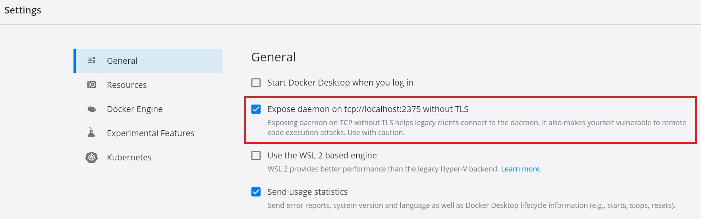

# Oracle GraalVM Enterprise ハンズオン演習 (Advance編)

##「2021-10-31 update：Spring BootおよびSpring Nativeのバージョンを最新版に更新」
## ＜目的と対象＞：
このハンズオン演習は、下記Oracle GraalVM Enterpriseハンズオン演習のアドバンス編になります。  
[Oracle GraalVM Enterprise ハンズオン演習 (Basic編)](https://github.com/junsuzu/graalvm-jp-handson-basic/)

Basic編では、次世代Polyglot(多言語プログラミング）対応実行環境であるOracle GraalVM Enterprise版の導入と操作手順を学びましたが、この演習ではGraalVMとフレームワークによるマイクロサービスの作成を実施します。演習を通じて以下の項目を体験することを目的としています。  
* GraalVMとMicronautによるアプリケーション開発
* GraalVMとSpring Bootによるアプリケーション開発  

このハンズオン演習の前提は上記Basic編を習得済みであることは望ましいが、必須ではありません。  

※この内容はOracle Java GBU主催のOracle GraalVM Enterprise 最新動向&ハンズオン・ワークショップの演習部分にあたります。  
参加者はこちらの内容に沿って事前環境セットアップおよび当日の演習を実施して頂けます。また単独でGraalVMのアドバンス編演習としてもご利用頂けます。  
<br/>

## ＜前提環境／事前準備＞
* OS: Windows10 + WSL(Windows Subsystem for Linux) + Ubuntu20.04  
* GraalVM EE 21.2.0.1 Java11 Linux版 (インストール方法は[ハンズオン演習 Basic編参照](https://github.com/junsuzu/graalvm-jp-handson-basic/)) (※本演習で必要なコンポーネントはCoreパッケージおよびNative Imageのみ)
* Docker Engine on Ubuntu ([Install Docker Engine on Ubuntu](https://nickjanetakis.com/blog/setting-up-docker-for-windows-and-wsl-to-work-flawlessly)) 
* Docker Desktop for Windows ([Install Docker Desktop for Windows](https://docs.docker.jp/docker-for-windows/install.html)) 
* Micronaut Linux版(オプション) ([SDKmanによるインストール](https://micronaut.io/download.html))
* IntelliJ IDEA Community 2020.3 Windows版(オプション)
* [Docker環境設定](#付録-Docker環境設定)

※ハンズオンの参加者は事前セットアップ済みの環境でハンズオン演習を実施して頂けます。ただし、演習が不要な方は、演習部分を視聴のみして頂くことも可能です。  
<br/>


## ＜演習内容＞

* **[演習1: GraalVMとMicronautによるマイクロサービス作成](#演習1-GraalVMとMicronautによるマイクロサービス作成)**
   * [1.1 Micronautアプリケーションの作成と起動](#11-Micronautアプリケーションの作成と起動)
   * [1.2 MicronautアプリケーションからNative Imageを作成](#12-MicronautアプリケーションからNative-Imageを作成)
   * [1.3 Native Imageを含むDockerコンテナを作成](#13-Native-Imageを含むDockerコンテナを作成)
   

* **[演習2: GraalVMとSpring Bootによるマイクロサービス作成](#演習2-GraalVMとSpring-Bootによるマイクロサービス作成)**
   * [2.1 Spring BootによるRESTful Webサービス作成](#21-Spring-BootによるRESTful-Webサービス作成)
   * [2.2 SpringアプリケーションからNative Imageを作成](#22-SpringアプリケーションからNative-Imageを作成)
   * [2.3 Native Imageを含むDockerコンテナを作成](#23-Native-Imageを含むDockerコンテナを作成)
<br/>
<br/>


# 演習1: GraalVMとMicronautによるマイクロサービス作成

この演習では、以下の内容を実施します。  
* Micronautアプリケーションの導入と稼働確認
* GraalVMでMicronautアプリのnative imageの作成と稼働確認
* Native Imageを含むDockerイメージを作成し、Dockerコンテナによるマイクロサービスの稼働を確認  
</br>

# 1.1 Micronautアプリケーションの作成と起動

(1) Micronautアプリケーションの作成  

任意のディレクトリーを作成し、その配下にMicronaut CLI(Command Line Interface)を利用してMicronautプロジェクトexample.micronaut.completeを作成します。
  >```sh
  >$ mn create-app example.micronaut.complete
  >```


上記コマンドより、completeフォルダが作成されていることをご確認ください。  
※Micronautを導入しない場合、下記コマンドでGitHubよりサンプルソースコードをダウンロードして利用してください。
  >```sh
  >$ git clone https://github.com/micronaut-guides/creating-your-first-micronaut-app.git
  >```

<br/>

(2)エディターもしくはIDE環境を使用し、上記(1)で作成したアプリケーションをカスタマイズし、Micronautコントローラーを追加します。  
src>main>java>example.microanutパッケージの配下に新規JavaソースファイルHelloController.javaを作成します。HelloControllerはHTTPリクエストに対して、"Hello World"という文字列をリターンします。下記はIntelliJ IDEAからcompleteフォルダーを開き、Javaファイルを新規追加するイメージです。


既存のApplicationおよび新規作成のHelloControllerのソースはそれぞれ下記をご確認ください。IntelliJ IDEA上ソースを作成したら、Ctrl+Sで保存します。
  
src/main/java/example/micronaut/Application.java
```java
package example.micronaut;

import io.micronaut.runtime.Micronaut;

public class Application {

    public static void main(String[] args) {
        Micronaut.run(Application.class);
    }
}
```  
src/main/java/example/micronaut/HelloController.java
```java
package example.micronaut;

import io.micronaut.http.MediaType;
import io.micronaut.http.annotation.Controller;
import io.micronaut.http.annotation.Get;
import io.micronaut.http.annotation.Produces;

@Controller("/hello")  //①
public class HelloController {
    @Get //②
    @Produces(MediaType.TEXT_PLAIN)  //③
    public String index() {
        return "Hello World"; //④
    }
}
```
* ① @Controller アノテーションがコントローラーを定義し、/helloというリクエスト・パスに対応します。  
* ② @Get アノテーションは下記index メソッドをすべてのHTTP Getリクエストに対応するようにマッピングします。
* ③ デフォルトではMicronautアプリのレスポンスのContentTypeはapplicaiton/jasonです。ここではJSONオブジェクトの代わりにStringをリターンしますので、text/plain を明示的に指定します。
* ④　"Hello World"　をリターンします。

(4)Javaソースファイルができましたら、LinuxターミナルからMicronautアプリケーションをbuildします。  
※以降のコマンドはすべてcomplete配下で実行してください。

  >```sh
  >$ ./gradlew assemble
  >```
出力結果をご確認ください。

```
Starting a Gradle Daemon (subsequent builds will be faster)
> Task :compileJava
Note: Creating bean classes for 1 type elements
> Task :compileTestJava
Note: Creating bean classes for 1 type elements

BUILD SUCCESSFUL in 26s
14 actionable tasks: 14 executed
```

(5)Micronautアプリケーションを起動します。
  >```sh
  >$ java -jar build/libs/complete-0.1-all.jar
  >```
Microanutアプリケーションの起動時間をメモに記録しておきます。

```
 __  __ _                                  _
|  \/  (_) ___ _ __ ___  _ __   __ _ _   _| |_
| |\/| | |/ __| '__/ _ \| '_ \ / _` | | | | __|
| |  | | | (__| | | (_) | | | | (_| | |_| | |_
|_|  |_|_|\___|_|  \___/|_| |_|\__,_|\__,_|\__|
  Micronaut (v2.3.0)

19:14:56.723 [main] INFO  io.micronaut.runtime.Micronaut - Startup completed in 5815ms. Server Running: http://localhost:8080
```
(6)別ターミナルを立ち上げ、アプリケーションにアクセスしてみましょう。"Hello World"がレスポンスとして表示されることを確認します。

>```sh
> $ curl http://localhost:8080/hello
> Hello World
>```
アプリケーションをCtrl+Cで停止します。  
<br/>

# 1.2 MicronautアプリケーションからNative Imageを作成

(1)complete配下のbuild.gradleを修正し、下記定義を追加し、ファイルを保存します。  
この定義により、native imageを生成時に、プラットフォーム依存のC標準libc以外は、すべての依存ライブラリをアプリケーションと静的に関連付けすることができます。これにより実行時の依存ライブラリへの動的参照を最小限に抑え、実行時のオーバーヘッドを低減させる効果があります。

  >```sh
  >  nativeImage {
  >  args("-H:+StaticExecutableWithDynamicLibC")
  >  }
  >```

(2) Gradleを使用し、Micronautサンプルアプリケーションのnative imageを作成します。  


  >```sh
  >$ ./gradlew nativeImage  
  >```
<br/>

環境によってNative Imageビルドに少し時間がかかります。  
Gradleで正常にビルドした結果、build/native-image/配下にapplicationという名前のnative imageが作成されていることが確認できます。  

(3)作成したMicronautアプリケーションのnative imageを動かしてみましょう。  
  >```sh
  >$ ./build/native-image/application  
  >```

アプリケーション起動した結果、8080番ポートでMicronautアプリケーションのサービスが短い時間で起動していることが確認できます。
```
$ ./build/native-image/application
13:22:50.338 [main] INFO  io.micronaut.runtime.Micronaut - Startup completed in 571ms. Server Running: http://localhost:8080
```
native imageの起動時間と上記演習1.1で通常のJavaアプリケーションの起動時間と比較し、native image起動の速さを確認します。  

別ターミナルを立ち上げ、起動中のサービスに対してリクエストを送ってみます。レスポンスのHello Worldが表示されることを確認します。
  >```sh
  >$ curl localhost:8080/hello  
  >Hello World
  >```
<br/>

アプリケーションをCtrl+Cで停止します。  
<br/>

# 1.3 Native Imageを含むDockerコンテナを作成

(1)Dockerデーモンを起動します。本演習の環境ではWindowsのDocker DesktopをDockerデーモンとして2375番ポートでオープンし、Ubuntu側のDockerクライアントはそのデーモンに接続します。下記はDocker Desktopのsetting画面です。



(2)complete配下に、Dockerfile.distrolessという名前のDockerファイルを作成します。ファイルの中に、軽量なベースイメージおよび生成済みのnative imageを指定します。

  >```sh
  >FROM gcr.io/distroless/base
  >COPY build/native-image/application app
  >ENTRYPOINT ["/app"]
  >```
<br/>  


(3)Native Imageを含むDockerイメージをビルドします。complete配下で以下のコマンドを実行します。

  >```sh
  >$  docker build -f Dockerfile.distroless -t complete:distroless .
  >```
<br/>

(4)Dockerコンテナを起動します。

  >```sh
  >$ docker run --rm -p 8080:8080 complete:distroless
  >```

Dockerコンテナーの起動時間と上記演習1.1、1.2の結果と比較します。
```
 __  __ _                                  _
|  \/  (_) ___ _ __ ___  _ __   __ _ _   _| |_
| |\/| | |/ __| '__/ _ \| '_ \ / _` | | | | __|
| |  | | | (__| | | (_) | | | | (_| | |_| | |_
|_|  |_|_|\___|_|  \___/|_| |_|\__,_|\__,_|\__|
  Micronaut (v2.3.0)

00:37:55.508 [main] INFO  io.micronaut.runtime.Micronaut - Startup completed in 118ms. Server Running: http://58e8ea26bdce:8080

```

別ターミナルを立ち上げ、起動中のDockerサービスに対してリクエストを送ってみます。レスポンスのHello Worldが表示されることを確認します。
  >```sh
  >$ curl localhost:8080/hello  
  >Hello World
  >```
<br/>

アプリケーションをCtrl+Cで停止します。  
<br/>

# 演習2: GraalVMとSpring Bootによるマイクロサービス作成
この演習では、以下の内容を実施します。  
* Springフレームワークを利用し、RESTfulのWebサービスを作成
* GraalVMでSpringアプリケーションのnative image作成と稼働確認
* Native Imageを含むDockerイメージを作成し、Dockerコンテナによるマイクロサービスの稼働を確認

</br>

# 2.1 Spring BootによるRESTful Webサービス作成

この演習の中でHTTPリクエストに対しJSONオブジェクト（Hello World !）をリターンする簡単なSpringアプリケーションを作成します。通常Springアプリケーションの作成はSpring Initializrの利用をお勧めですが、この演習ではサンプルソースコードをダウンロードし、カスタマイズするアプローチで進めます。

(1) Springサンプルソースのダウンロード  

Githubよりソースをダウンロードします。ダウンロード後completeディレクトリー配下に移動します。以降のコマンド実行はすべてcomplete配下で行います。

  >```sh
  >git clone https://github.com/spring-guides/gs-rest-service
  >cd gs-rest-service/complete
  >```

(2)VScodeなどのIDEを使ってcompleteフォルダーを開き、中にあるJavaソースやpom.xmlを編集します。  
* Plain Java Objectクラスを作成します。src/main/java/com/example/restservice/Greeting.java　　
```java
package com.example.restservice;

public class Greeting {

	private final long id;
	private final String content;

	public Greeting(long id, String content) {
		this.id = id;
		this.content = content;
	}

	public long getId() {
		return id;
	}

	public String getContent() {
		return content;
	}
}
```
* HTTPリクエストをハンドリングするResource Controllerを作成（確認）します。src/main/java/com/example/restservice/GreetingController.java
```java
package com.example.restservice;

import java.util.concurrent.atomic.AtomicLong;

import org.springframework.web.bind.annotation.GetMapping;
import org.springframework.web.bind.annotation.RequestParam;
import org.springframework.web.bind.annotation.RestController;

@RestController
public class GreetingController {

	private static final String template = "Hello, %s!";
	private final AtomicLong counter = new AtomicLong();

	@GetMapping("/greeting")
	public Greeting greeting(@RequestParam(value = "name", defaultValue = "World") String name) {
		return new Greeting(counter.incrementAndGet(), String.format(template, name));
	}
}
```

(3)pom.xmlを開き、Spring Nativeのバージョンを2.5.6、Javaバージョンを本演習環境に合わせて1.8から11に変更します。
```
 <?xml version="1.0" encoding="UTF-8"?>
<project xmlns="http://maven.apache.org/POM/4.0.0" xmlns:xsi="http://www.w3.org/2001/XMLSchema-instance"
	xsi:schemaLocation="http://maven.apache.org/POM/4.0.0 https://maven.apache.org/xsd/maven-4.0.0.xsd">
	<modelVersion>4.0.0</modelVersion>
	<parent>
		<groupId>org.springframework.boot</groupId>
		<artifactId>spring-boot-starter-parent</artifactId>
		<version>2.5.2</version>
		<relativePath/> <!-- lookup parent from repository -->
	</parent>
	<groupId>com.example</groupId>
	<artifactId>rest-service-complete</artifactId>
	<version>0.0.1-SNAPSHOT</version>
	<name>rest-service-complete</name>
	<description>Demo project for Spring Boot</description>
	<properties>
		<java.version>11</java.version>
	</properties>
```

(4)Mavenを使い実行可能なJARファイルにビルドし、実行します。
 >```sh
 >./mvnw clean package
 >```
```
[INFO] Tests run: 2, Failures: 0, Errors: 0, Skipped: 0, Time elapsed: 7.808 s - in com.example.restservice.GreetingControllerTests
[INFO]
[INFO] Results:
[INFO]
[INFO] Tests run: 2, Failures: 0, Errors: 0, Skipped: 0
[INFO]
[INFO]
[INFO] --- maven-jar-plugin:3.2.0:jar (default-jar) @ rest-service-complete ---
[INFO] Building jar: /home/linuser/project/tmp/test/gs-rest-service/complete/target/rest-service-complete-0.0.1-SNAPSHOT.jar
[INFO]
[INFO] --- spring-boot-maven-plugin:2.5.6:repackage (repackage) @ rest-service-complete ---
Downloading from central: https://repo.maven.apache.org/maven2/org/springframework/boot/spring-boot-buildpack-platform/2.5.6/spring-boot-buildpack-platform-2.5.6.pom
Downloaded from central: https://repo.maven.apache.org/maven2/org/springframework/boot/spring-boot-buildpack-platform/2.5.6/spring-boot-buildpack-platform-2.5.6.pom (3.2 kB at 5.5 kB/s)
Downloading from central: https://repo.maven.apache.org/maven2/org/springframework/boot/spring-boot-loader-tools/2.5.6/spring-boot-loader-tools-2.5.6.pom
Downloaded from central: https://repo.maven.apache.org/maven2/org/springframework/boot/spring-boot-loader-tools/2.5.6/spring-boot-loader-tools-2.5.6.pom (2.3 kB at 4.8 kB/s)
Downloading from central: https://repo.maven.apache.org/maven2/org/springframework/boot/spring-boot-buildpack-platform/2.5.6/spring-boot-buildpack-platform-2.5.6.jar
Downloading from central: https://repo.maven.apache.org/maven2/org/springframework/boot/spring-boot-loader-tools/2.5.6/spring-boot-loader-tools-2.5.6.jar
Downloaded from central: https://repo.maven.apache.org/maven2/org/springframework/boot/spring-boot-loader-tools/2.5.6/spring-boot-loader-tools-2.5.6.jar (250 kB at 379 kB/s)
Downloaded from central: https://repo.maven.apache.org/maven2/org/springframework/boot/spring-boot-buildpack-platform/2.5.6/spring-boot-buildpack-platform-2.5.6.jar (238 kB at 353 kB/s)
[INFO] Replacing main artifact with repackaged archive
[INFO] ------------------------------------------------------------------------
[INFO] BUILD SUCCESS
[INFO] ------------------------------------------------------------------------
[INFO] Total time:  44.067 s

```

正常ビルド完了後、JARファイルを実行します。Web Serviceの起動時間を確認します。
>```sh
 >java -jar target/rest-service-complete-0.0.1-SNAPSHOT.jar
 >```

```
  .   ____          _            __ _ _
 /\\ / ___'_ __ _ _(_)_ __  __ _ \ \ \ \
( ( )\___ | '_ | '_| | '_ \/ _` | \ \ \ \
 \\/  ___)| |_)| | | | | || (_| |  ) ) ) )
  '  |____| .__|_| |_|_| |_\__, | / / / /
 =========|_|==============|___/=/_/_/_/
 :: Spring Boot ::                (v2.5.6)

2021-10-30 14:52:13.829  INFO 2195 --- [           main] c.e.restservice.RestServiceApplication   : Starting RestServiceApplication v0.0.1-SNAPSHOT using Java 11.0.12 on JUNSUZU-JP with PID 2195 (/home/linuser/project/tmp/test/gs-rest-service/complete/target/rest-service-complete-0.0.1-SNAPSHOT.jar started by linuser in /home/linuser/project/tmp/test/gs-rest-service/complete)
2021-10-30 14:52:13.836  INFO 2195 --- [           main] c.e.restservice.RestServiceApplication   : No active profile set, falling back to default profiles: default
2021-10-30 14:52:15.274  INFO 2195 --- [           main] o.s.b.w.embedded.tomcat.TomcatWebServer  : Tomcat initialized with port(s): 8080 (http)
2021-10-30 14:52:15.292  INFO 2195 --- [           main] o.apache.catalina.core.StandardService   : Starting service [Tomcat]
2021-10-30 14:52:15.293  INFO 2195 --- [           main] org.apache.catalina.core.StandardEngine  : Starting Servlet engine: [Apache Tomcat/9.0.54]
2021-10-30 14:52:15.374  INFO 2195 --- [           main] o.a.c.c.C.[Tomcat].[localhost].[/]       : Initializing Spring embedded WebApplicationContext
2021-10-30 14:52:15.375  INFO 2195 --- [           main] w.s.c.ServletWebServerApplicationContext : Root WebApplicationContext: initialization completed in 1464 ms
2021-10-30 14:52:15.949  INFO 2195 --- [           main] o.s.b.w.embedded.tomcat.TomcatWebServer  : Tomcat started on port(s): 8080 (http) with context path ''
2021-10-30 14:52:15.987  INFO 2195 --- [           main] c.e.restservice.RestServiceApplication   : Started RestServiceApplication in 2.644 seconds (JVM running for 3.321)
```
(4)別ターミナルを立ち上げ、以下のコマンドを実行し、HTTPリクエストからレスポンスが正常にリターンされることを確認します。
```sh
$ curl http://localhost:8080/greeting
{"id":1,"content":"Hello, World!"}
```
# 2.2 SpringアプリケーションからNative Imageを作成
(1)pom.xmlを編集します。
<br/>

<1>Springアプリケーションをnative imageとして実行するため、「spring-native」dependencyを指定します。バージョンは0.10.5に指定します。
```
<dependencies>
    <!-- ... -->
    <dependency>
        <groupId>org.springframework.experimental</groupId>
        <artifactId>spring-native</artifactId>
        <version>0.10.5</version>
    </dependency>
</dependencies>
```

<2>SpringアプリケーションをAOTコンパイラでビルドするため、Spring Frameworkより提供されているspring-aot-maven-plugin（0.10.5）を指定します。以下のplugin内容を「build」ブロックに追加します。
```
<build>
    <plugins>
        <!-- ... -->
        <plugin>
            <groupId>org.springframework.experimental</groupId>
            <artifactId>spring-aot-maven-plugin</artifactId>
            <version>0.10.5</version>
            <executions>
                <execution>
                    <id>test-generate</id>
                    <goals>
                        <goal>test-generate</goal>
                    </goals>
                </execution>
                <execution>
                    <id>generate</id>
                    <goals>
                        <goal>generate</goal>
                    </goals>
                </execution>
            </executions>
        </plugin>
    </plugins>
</build>
```

<3>Springアプリケーションをnative imageとしてビルドするため、GraalVMより提供されているnative-maven-plugin(0.9.4)をprofileブロックの中で指定します。
```
    <profiles>
        <profile>
            <id>native</id>
            <build>
                <plugins>
                    <plugin>
                        <groupId>org.graalvm.buildtools</groupId>
                        <artifactId>native-maven-plugin</artifactId>
                        <version>0.9.4</version>
                        <executions>
                            <execution>
                                <id>test-native</id>
                                <goals>
                                    <goal>test</goal>
                                </goals>
                                <phase>test</phase>
                            </execution>
                            <execution>
                                <id>build-native</id>
                                <goals>
                                    <goal>build</goal>
                                </goals>
                                <phase>package</phase>
                            </execution>
                        </executions>
                        <configuration>
                            <!-- ... -->
                        </configuration>
                    </plugin>
                    <!-- Avoid a clash between Spring Boot repackaging and native-maven-plugin -->
                    <plugin>
                        <groupId>org.springframework.boot</groupId>
                        <artifactId>spring-boot-maven-plugin</artifactId>
                        <configuration>
                            <classifier>exec</classifier>
                        </configuration>
                    </plugin>
                </plugins>
            </build>
        </profile>
    </profiles>
```

<4>以下「spring-naitve」dependencyおよびpluginを構成するためのリポジトリー「spring-release」を追加します。
```
<repositories>
		<!-- ... -->
		<repository>
			<id>spring-release</id>
			<name>Spring release</name>
			<url>https://repo.spring.io/release</url>
		</repository>
	</repositories>
```
```
<pluginRepositories>
		<!-- ... -->
		<pluginRepository>
			<id>spring-release</id>
			<name>Spring release</name>
			<url>https://repo.spring.io/release</url>
		</pluginRepository>
	</pluginRepositories>
```

(2)GreetingController.javaを編集し、レスポンスでリターンされる文字列を変更します。例：  
```
defaultValue = "World with Native Image"
```
(3)以下のコマンドでSpringアプリケーションをnative imageへビルドします。  
```sh
$ ./mvnw -Pnative -DskipTests package
```
Native Imageが正常にビルドされることを確認します。

```
[rest-service-complete:6797]     (clinit):   2,602.70 ms,  6.71 GB
[rest-service-complete:6797]   (typeflow):  79,947.44 ms,  6.71 GB
[rest-service-complete:6797]    (objects):  58,484.88 ms,  6.71 GB
[rest-service-complete:6797]   (features):   9,333.39 ms,  6.71 GB
[rest-service-complete:6797]     analysis: 155,122.43 ms,  6.71 GB
[rest-service-complete:6797]     universe:   9,007.28 ms,  6.71 GB
[rest-service-complete:6797]      (parse):   8,338.72 ms,  6.71 GB
[rest-service-complete:6797]     (inline):  10,799.34 ms,  6.40 GB
[rest-service-complete:6797]    (compile): 183,531.73 ms,  5.73 GB
[rest-service-complete:6797]      compile: 210,390.41 ms,  5.73 GB
[rest-service-complete:6797]        image:  24,208.31 ms,  5.79 GB
[rest-service-complete:6797]        write:   6,097.02 ms,  5.79 GB
[rest-service-complete:6797]      [total]: 422,965.12 ms,  5.79 GB
# Printing build artifacts to: /home/linuser/project/tmp/test/gs-rest-service/complete/target/rest-service-complete.build_artifacts.txt
[INFO]
[INFO] --- spring-boot-maven-plugin:2.5.6:repackage (repackage) @ rest-service-complete ---
[INFO] Attaching repackaged archive /home/linuser/project/tmp/test/gs-rest-service/complete/target/rest-service-complete-0.0.1-SNAPSHOT-exec.jar with classifier exec
[INFO] ------------------------------------------------------------------------
[INFO] BUILD SUCCESS
[INFO] ------------------------------------------------------------------------
[INFO] Total time:  08:16 min
```
target配下にnative image "rest-service-complete"が生成されたことを確認します。

(4)以下のコマンドでnative imageを実行します。
```
target/rest-service-complete
```
Springアプリケーションの起動時間を確認し、演習2.1の結果と比較します。
```
2021-10-30 19:22:26.422  INFO 7007 --- [           main] o.s.nativex.NativeListener               : This application is bootstrapped with code generated with Spring AOT

  .   ____          _            __ _ _
 /\\ / ___'_ __ _ _(_)_ __  __ _ \ \ \ \
( ( )\___ | '_ | '_| | '_ \/ _` | \ \ \ \
 \\/  ___)| |_)| | | | | || (_| |  ) ) ) )
  '  |____| .__|_| |_|_| |_\__, | / / / /
 =========|_|==============|___/=/_/_/_/
 :: Spring Boot ::                (v2.5.6)

2021-10-30 19:22:26.426  INFO 7007 --- [           main] c.e.restservice.RestServiceApplication   : Starting RestServiceApplication v0.0.1-SNAPSHOT using Java 11.0.12 on JUNSUZU-JP with PID 7007 (/home/linuser/project/tmp/test/gs-rest-service/complete/target/rest-service-complete started by linuser in /home/linuser/project/tmp/test/gs-rest-service/complete)
2021-10-30 19:22:26.427  INFO 7007 --- [           main] c.e.restservice.RestServiceApplication   : No active profile set, falling back to default profiles: default
2021-10-30 19:22:26.467  INFO 7007 --- [           main] o.s.b.w.embedded.tomcat.TomcatWebServer  : Tomcat initialized with port(s): 8080 (http)
2021-10-30 19:22:26.468  INFO 7007 --- [           main] o.apache.catalina.core.StandardService   : Starting service [Tomcat]
2021-10-30 19:22:26.469  INFO 7007 --- [           main] org.apache.catalina.core.StandardEngine  : Starting Servlet engine: [Apache Tomcat/9.0.54]
2021-10-30 19:22:26.479  INFO 7007 --- [           main] o.a.c.c.C.[Tomcat].[localhost].[/]       : Initializing Spring embedded WebApplicationContext
2021-10-30 19:22:26.479  INFO 7007 --- [           main] w.s.c.ServletWebServerApplicationContext : Root WebApplicationContext: initialization completed in 49 ms
2021-10-30 19:22:27.541  INFO 7007 --- [           main] o.s.b.w.embedded.tomcat.TomcatWebServer  : Tomcat started on port(s): 8080 (http) with context path ''
2021-10-30 19:22:27.545  INFO 7007 --- [           main] c.e.restservice.RestServiceApplication   : Started RestServiceApplication in 1.14 seconds (JVM running for 1.142)
```
(5)別ターミナルを立ち上げ、以下のコマンドを実行し、HTTPリクエストからレスポンスが正常にリターンされることを確認します。
```sh
$ curl http://localhost:8080/greeting
{"id":1,"content":"Hello, World with Native Image!"}
```
# 2.3 Native Imageを含むDockerコンテナを作成
Spring Bootが[Cloud Native Buildpacks](https://buildpacks.io/)へのサポートを提供し、Dockerfileを書かずにMavenおよびGradleプラグインからDockerイメージをビルドする機能をサポートします。

(1)演習2.2で編集したpom.xmlに対しさらに編集を加えます。  
Buildpackを利用するため、buildタグ内のpluginの内容が以下になるように編集します。  
Spring Bootから提供されるspring-boot-maven-pluginおよび使用するBuildpackのイメージ(paketobuildpacks/builder:tiny)を指定します。また、BP_BOOT_NATIVE_IMAGE 環境変数の値をtrueに指定します。
```
<plugin>
    <groupId>org.springframework.boot</groupId>
    <artifactId>spring-boot-maven-plugin</artifactId>
    <configuration>
        <image>
            <builder>paketobuildpacks/builder:tiny</builder>
            <env>
                <BP_NATIVE_IMAGE>true</BP_NATIVE_IMAGE>
            </env>
        </image>
    </configuration>
</plugin>
```
(2)GreetingController.javaを編集し、レスポンスでリターンされる文字列を変更します。例：  
```
defaultValue = "World with Native Image in Docker"
```
(3)Native Imageを含むDockerコンテナイメージをビルドします。  
下記コマンド実行より、Spring Bootアプリケーションからnative imageを生成し、それを含むDockerコンテナイメージをビルドします。  
(※ビルド時Dockerデーモンを起動している必要があります。この演習ではWindows版Desktop Dockerを起動します。)
```
$ ./mvnw spring-boot:build-image
```
ビルドが正常終了したことを確認し、docker imagesコマンドで生成されたイメージを確認します。
```
[INFO]     [creator]     # Printing build artifacts to: /layers/paketo-buildpacks_native-image/native-image/com.example.restservice.RestServiceApplication.build_artifacts.txt
[INFO]     [creator]       Removing bytecode
[INFO]     [creator]       Process types:
[INFO]     [creator]         native-image: /workspace/com.example.restservice.RestServiceApplication (direct)
[INFO]     [creator]         task:         /workspace/com.example.restservice.RestServiceApplication (direct)
[INFO]     [creator]         web:          /workspace/com.example.restservice.RestServiceApplication (direct)
[INFO]     [creator]     ===> EXPORTING
[INFO]     [creator]     Adding layer 'paketo-buildpacks/ca-certificates:helper'
[INFO]     [creator]     Adding 1/1 app layer(s)
[INFO]     [creator]     Adding layer 'launcher'
[INFO]     [creator]     Adding layer 'config'
[INFO]     [creator]     Adding layer 'process-types'
[INFO]     [creator]     Adding label 'io.buildpacks.lifecycle.metadata'
[INFO]     [creator]     Adding label 'io.buildpacks.build.metadata'
[INFO]     [creator]     Adding label 'io.buildpacks.project.metadata'
[INFO]     [creator]     Adding label 'org.opencontainers.image.title'
[INFO]     [creator]     Adding label 'org.opencontainers.image.version'
[INFO]     [creator]     Adding label 'org.springframework.boot.version'
[INFO]     [creator]     Setting default process type 'web'
[INFO]     [creator]     Saving docker.io/library/rest-service-complete:0.0.1-SNAPSHOT...
[INFO]     [creator]     *** Images (2732a4cd2039):
[INFO]     [creator]           docker.io/library/rest-service-complete:0.0.1-SNAPSHOT
[INFO]     [creator]     Adding cache layer 'paketo-buildpacks/graalvm:jdk'
[INFO]     [creator]     Adding cache layer 'paketo-buildpacks/native-image:native-image'
[INFO]
[INFO] Successfully built image 'docker.io/library/rest-service-complete:0.0.1-SNAPSHOT'
[INFO]
[INFO] ------------------------------------------------------------------------
[INFO] BUILD SUCCESS
[INFO] ------------------------------------------------------------------------
[INFO] Total time:  07:11 min
```
dockerコマンドで生成されたDockerイメージを確認します。
```
docker images
REPOSITORY                 TAG              IMAGE ID       CREATED        SIZE
paketobuildpacks/run       tiny-cnb         59e86ed6bb4f   39 hours ago   17.4MB
rest-service-complete      0.0.1-SNAPSHOT   2732a4cd2039   41 years ago   95.5MB
paketobuildpacks/builder   tiny             327b16eb4111   41 years ago   455MB
```
(4)上記生成されたDocker コンテナイメージを実行します。 
```
docker run --rm -p 8080:8080 rest-service-complete:0.0.1-SNAPSHOT
```
コンテナの起動結果および起動時間を確認し、演習2.1,2.2の結果と比較します。
```
docker run --rm -p 8080:8080 rest-service-complete:0.0.1-SNAPSHOT
2021-10-30 17:11:47.592  INFO 1 --- [           main] o.s.nativex.NativeListener               : This application is bootstrapped with code generated with Spring AOT

  .   ____          _            __ _ _
 /\\ / ___'_ __ _ _(_)_ __  __ _ \ \ \ \
( ( )\___ | '_ | '_| | '_ \/ _` | \ \ \ \
 \\/  ___)| |_)| | | | | || (_| |  ) ) ) )
  '  |____| .__|_| |_|_| |_\__, | / / / /
 =========|_|==============|___/=/_/_/_/
 :: Spring Boot ::                (v2.5.6)

2021-10-30 17:11:47.594  INFO 1 --- [           main] c.e.restservice.RestServiceApplication   : Starting RestServiceApplication using Java 11.0.13 on 1cf719ada7b5 with PID 1 (/workspace/com.example.restservice.RestServiceApplication started by cnb in /workspace)
2021-10-30 17:11:47.594  INFO 1 --- [           main] c.e.restservice.RestServiceApplication   : No active profile set, falling back to default profiles: default
2021-10-30 17:11:47.628  INFO 1 --- [           main] o.s.b.w.embedded.tomcat.TomcatWebServer  : Tomcat initialized with port(s): 8080 (http)
2021-10-30 17:11:47.629  INFO 1 --- [           main] o.apache.catalina.core.StandardService   : Starting service [Tomcat]
2021-10-30 17:11:47.629  INFO 1 --- [           main] org.apache.catalina.core.StandardEngine  : Starting Servlet engine: [Apache Tomcat/9.0.54]
2021-10-30 17:11:47.635  INFO 1 --- [           main] o.a.c.c.C.[Tomcat].[localhost].[/]       : Initializing Spring embedded WebApplicationContext
2021-10-30 17:11:47.635  INFO 1 --- [           main] w.s.c.ServletWebServerApplicationContext : Root WebApplicationContext: initialization completed in 40 ms
2021-10-30 17:11:47.660  INFO 1 --- [           main] o.s.b.w.embedded.tomcat.TomcatWebServer  : Tomcat started on port(s): 8080 (http) with context path ''
2021-10-30 17:11:47.661  INFO 1 --- [           main] c.e.restservice.RestServiceApplication   : Started RestServiceApplication in 0.082 seconds (JVM running for 0.084)
```
(5)別ターミナルを立ち上げ、以下のコマンドを実行し、HTTPリクエストからレスポンスが正常にリターンされることを確認します。
```sh
$ curl http://localhost:8080/greeting
{"id":1,"content":"Hello, World with Native Image in Docker!"}
```
<br/>
お疲れ様でした！  

ここまでは、Oracle GraalVM Enterprise ハンズオン演習 (Advance編)の内容はすべて終了しました。この演習では以下の項目について学びました。
 
* GraalVMとMicronautによるマイクロサービスの作成と実行
* GraalVMとSpring Bootによるマイクロサービスの作成と実行

</br>

## <付録> Docker環境設定
* Docker Desktop for WindowsのSettings画面で、"Expose daemon on tcp://localhost:2375 without TLS"項目にチェックを入れてください。
* Docker Desktop for WindowsのSettings画面で、メモリを4GB～8GBにアサインしてください。
* WSLからDocker Desktop for Windowsへの接続設定：  

~/.bashrcを修正します。
```sh
vi ~/.bashrc
```
以下の行を追加します：  
```sh
export DOCKER_HOST=tcp://localhost:2375
```
ファイルを修正後、以下のコマンドで実行します。
```sh
source ~/.bashrc
```

